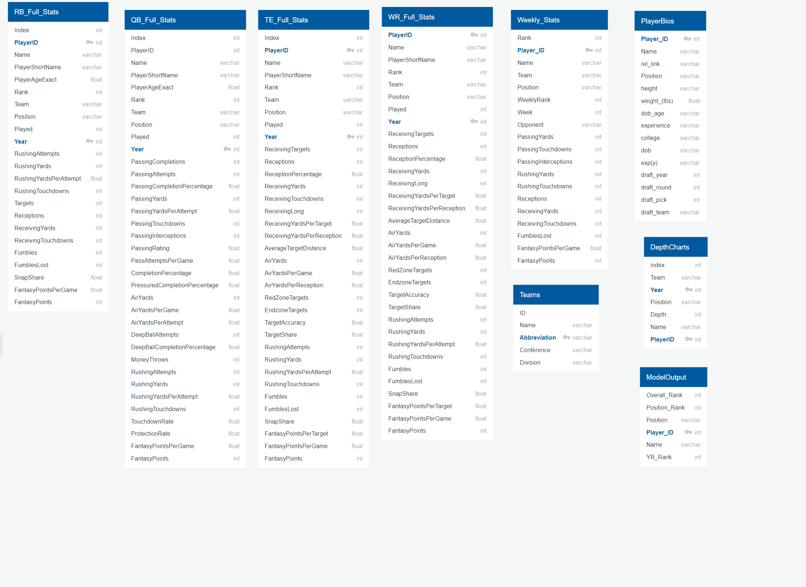

# Fantasy Football Predictions
## Selected Topic 
Predicting player fantasy football output in the upcoming 2022 season.

## Reasons 
Fantasy Football is a game that allows a person to be the owner, manager and coach of their very own professional football team. You can compete against your friends, by drafting a team made up of NFL players and score points based on their weekly on field performance. At the start of each week you are placed in a head to head match up with another person in your league and the team's points are added up, and whichever team with the most points that week wins. We want to create a supervised machine learning model that predicts the potential output of players in the upcoming year using previous seasons statistics, allowing people who use our results to have an upper hand and help them make an informed decision when selecting their team during their draft this fall. 

## Questions to be Answered 
- How many total points will a player have in the 2022 football season?  
- Can we determine what the top 10 picks are for each offensive positions, to help people make draft decisions?
- Can we create a top 200 including all positions?
- Is there validity to drafting players that performed better towards the end of the previous season?

## Dashboard
### Storyboard
[Presentation](https://docs.google.com/presentation/d/1g4S6FTzFQ1K1Ju-CnPEBZbU-fY2Y4ZVle-vF5rL6RwQ/edit#slide=id.p)

### Tools
- HTML5
- CSS
- JavaScript
- Bootstrap
- Google Font API
- Font Awesome
- PyScript

### Interactive Elements
Interactive elements will include a webpage with multiple pages, mobile responsiveness & interactive header, body and footer. There will be a table with statistics of the top 10 players of each offensive position on the Top Ten hmtl page. On the All Players html page, there will be a table with the top 200 players and a drop down with different fantasy scoring systems that can be selected. 

## Data Collection 
### Overview
Majority of this project's data resides on the [Fantasy Data website](https://fantasydata.com/), and is available through various downloadable tables with a subscription. The team also utilized web scraping and an existing GitHub table to gather supporting information.  

The intitial analysis for this project incorporates the past 4 years of the annual statistics for the main four fantasy football positions: quarterback (QB), running back (RB), wide receiver (WR), and tight end (TE). Supporting information includes the complete set of NFL teams and their basic information as well as the players' background information including depth information. All data sources were chosen due to the accuracy, completeness of the data for previous years, and the effort of retreival. The final database contains 9 tables that are primarily connected by position and Player ID.  Most of the transforming focused on duplicate information and connecting the data sources.  

### Player Data 
#### Annual Statistics  
The primary input for our modeling consist of four tables from the database that contain annual statistics for each position spanning 2018-2021 seasons. 
Each position had two downloadable CSV files per year that were merged and underwent [initial clean up](./database/database_merging_cleanup_final.ipynb). *Source: Downloaded from Fantasy Data*

#### Weekly Statistics
The database includes 4 tables that contain the weekly stats for all positions per year. These tables comprise of downloaded data as well, and tie to the annual statistics by Player ID.  The weekly stats were introduced for a deeper learning for future projects. For organizational purposes, the weekly stats were combined and given a Year column during [preprocessing](./database/importData_weeklystats.ipynb).  *Source: Downloaded from Fantasy Data*

#### Player Bios
While the machine learning portion of the project solely utilizes the annual statistics, the player biographies are used to further evaluate trends in the data. We utilized webscraping in order to obtain this information, and did [minimal clean up](./database/importData_playerbios.ipynb). *Source: Webscraped from Fantasy Data*

#### Depth Chart
Predicting future rank depends on the potential play time for the upcoming season, which should be incorporated in the machine learning.  In order to compensate for this variable, the depth chart information from 2018-2022 was scraped.  Since the data came from a different source, mapping was conducted to tie the player name to the Fantasy Data Player ID.  *Source: [Our Lads' Depth Chart](https://www.ourlads.com/nfldepthcharts/)*

### Teams
#### Team Summary
The weekly and annual player data relied on team abbreviations, so this table is used to connect abbreviations to the team's full name, conference, and division. *Source: [github/cnizzardini/nfl_teams.csv](https://gist.github.com/cnizzardini/13d0a072adb35a0d5817)*

## Machine Learning Model
### Overview

As previously stated the end goal of the model is to predict which players will perform well next year. The model created takes in statistics from one full year and predicts the fantasy points end total for the year requested. 

#### Description of preliminary data preprocessing/Description of how data was split into training and testing sets

The program currently requests input that affect the target data such as how many points a quarterback receives for a passing touchdown, and does the league provide a point per reception. Then a predicted year is selected via user input.

The following is the questions the program prompts in order to generate the datasets as requested:

The training data set is all of the previous years compared to the results of the following year (see updates since last model submission section below for more detail). The data is also queried for the following year and the fantasy point total for the following year is calculated based on that year's statistics.
The final fantasy results from the following year is merged with the dataframe for the selected training year. This is then appended to a list of dataframes. The process is repeated for each position.

After this process is completed the data for the prediction year feature data is aggregated and in a list of dataframes. Additional data is prepared in this function to provide an easy visual regarding how well the model performed on the year selected.

#### Description of preliminary feature engineering and preliminary feature selection, including decision-making process 

Initially all statistics we received were used as a feature in our feature selection. This led to overfitting and caused the model to provide poor results. After looking at the weights of each feature in the model we noticed that there were a few features that seemed to overpower the other features in the model.
In addition, we looked at the histograms of the feature distribution and saw that certain features were inconsistent between years and varied dramatically. We removed these features and then attempted to pare down the features to roughly the top 10 that we believed to affect the model using the coefficients as our guide.
The goal was to try remove features that seemed to be too influential, or too irrelevant and logically wouldn’t have much effect on the next years data. 

The following is the an example of the model information that was used to make the determinations discussed above:

#### Description of how data was split into training and testing sets

As mentioned earlier the user provides the prediction year and the model is trained on all data we have at our disposal up until that year. This process grabs the data of that year and merges it with the target which is derived by calculating the fantasy points for the next season based on the following years statistics.
The features are split from the target and a multiple linear regression model is trained on the requested data set. The testing set is also input by the user based on the input question "which year would you like to predict?".  

##### Updates since last model submission

In the last iteration there was a selection that asked "which year would you like to train the data on?" This option has been removed and now the model only asks the question "which year would you like to predict?". The data is then prepared by making every year up until the predicted year as part of the training set.
If for instance the prediction year was 2021 the training set would consist of the following: 2018 data merged with 2019 results and 2019 data merged with 2020 results. The test set is then the 2020 data merged with the 2021 results. 

An example of what the output of the model looks like for a particular position is the following:

This visual serves as a far better determination of how successful the model is than an accuracy score. In fantasy football the determination of how close the fantasy point projection is away from the actual, isn't nearly as important as determining who should be selected.

This means that the predicted rank is more important than the difference of the projection from the actual. Above you can see last year's rank in the second column, the sorted fantasy point projection in the 2021_proj column, and the 2021 actual rank. If the model was perfect the sorting of the 2021_proj would cause the 2021 Actual Rank column to start at 1 and be ordered sequentially.  

In addition to this structural modification to the model we also took the weekly data for each player and generated a linear regression model comparing the week number to the fantasy points. Then from this model the slope was taken to determine whether the player was trending up or down through the course of the season.

A value was also assigned for consistency rating which compared the fantasy point standard deviation to the mean performance.

The other modification to the model was the addition of depth chart information. This helps de-rank players that likely wont get as much playing time the following year.    

#### Explanation of model choice, including limitations and benefits

A multiple linear regression model was selected because a given year does not provide many data points. For instance, a given year would only have roughly 32 starting quarterbacks to train a model. This causes our model to be particularly susceptible to overfitting.  In the most recent iteration we used multiple years of data to make the model more robust. So for the 2021 prediction model 2 years of data was used to train the model, and for the 2022 prediction model 3 years of data is used. 

As a result, we opted to try to use a more crude machine learning model (multiple linear regression) and limit the number of features. The downside of using this model is that the features do not have much interaction in a multiple linear regression model.
Each feature would have a weight that would map to a final projected fantasy output, but a feature touchdown efficiency would not be able to provide a different weight depending on how many touchdowns a player scored in a particular year.
In addition, many selected features can be intuitively determined not to be linear. The perfect example of this is age. As a player starts off early in their career, they are likely to have an adjustment period to the NFL.
This typically results in a slow start for rookies. The next couple of years good players tend to improve dramatically until they hit the prime of their career and then the decline varies per position. This is likely better modeled by a quadratic formula rather than a linear one.  
